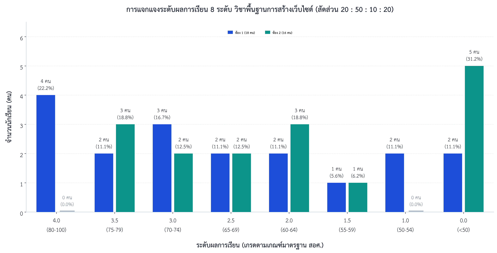
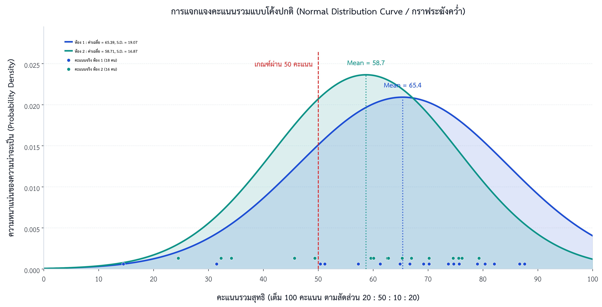

# 📊 ระบบประมวลผลคะแนน วิเคราะห์ข้อสอบ และจำลองการตัดเกรด (20 : 50 : 10 : 20)

[](https://github.com/PichyyyNews/web-dev-grading-analysis-21909-1006)
[](https://github.com/PichyyyNews/web-dev-grading-analysis-21909-1006)
[](https://github.com/PichyyyNews/web-dev-grading-analysis-21909-1006)
[](https://github.com/PichyyyNews/web-dev-grading-analysis-21909-1006)
[](https://github.com/PichyyyNews/web-dev-grading-analysis-21909-1006)

ระบบรวบรวม บริหารจัดการข้อมูลผลการเรียน ตรวจข้อสอบปลายภาคพร้อมวิเคราะห์คุณภาพข้อสอบ (Item Analysis) จัดหมวดหมู่คะแนนเก็บแบบฝึกหัด 10 ชิ้นงาน และจัดทำแบบจำลองการตัดเกรดมาตรฐานสำนักงานคณะกรรมการการอาชีวศึกษา (สอศ.) สัดส่วน **20 : 50 : 10 : 20** สำหรับนักเรียนระดับชั้น **ประกาศนียบัตรวิชาชีพ (ปวช.) ชั้นปีที่ 1 สาขาวิชาช่างเทคโนโลยีคอมพิวเตอร์ (ชทค. 1 และ ชทค. 2 รวม 34 คน)**

---

## 📈 แผนภูมิสถิติและการกระจายตัวของผลการเรียน (Visual Analytics)

### 1. แผนภูมิแท่งเปรียบเทียบการแจกแจงระดับผลการเรียน 8 ระดับ (Grouped Bar Chart)
แสดงการเปรียบเทียบจำนวนนักเรียนและร้อยละในแต่ละระดับเกรด (0.0 ถึง 4.0) ระหว่าง **ห้อง 1 (18 คน)** และ **ห้อง 2 (16 คน)**



> **ข้อค้นพบหลักจากแผนภูมิแท่ง:**
> - **กลุ่มผลการเรียนดีเยี่ยม (เกรด 4.0):** อยู่ในห้อง 1 จำนวน 4 คน (22.2%) ในขณะที่ห้อง 2 ไม่มีผู้ได้เกรด 4.0 เนื่องจากคะแนนเก็บและคะแนนสอบปลายภาคเฉลี่ยต่ำกว่า
> - **กลุ่มผลการเรียนระดับกลางถึงดี (เกรด 2.0 – 3.5):** มีการกระจายตัวใกล้เคียงกันทั้งสองห้อง
> - **กลุ่มที่ไม่ผ่านเกณฑ์ (เกรด 0.0):** ห้อง 2 มีสัดส่วน 31.2% (5 คน) สูงกว่าห้อง 1 ซึ่งมี 11.1% (2 คน) สอดคล้องกับพฤติกรรมการส่งงานและคะแนนสอบปลายภาค

---

### 2. การแจกแจงคะแนนรวมแบบโค้งปกติ / กราฟระฆังคว่ำ (Normal Distribution Bell Curve)
แสดงฟังก์ชันความหนาแน่นของความน่าจะเป็น (Probability Density Function) ของคะแนนรวมสุทธิ 100 คะแนน เปรียบเทียบระหว่างห้อง 1 และ ห้อง 2 พร้อมเส้นเกณฑ์ผ่าน 50 คะแนน และตำแหน่งคะแนนจริงของนักเรียนแต่ละคน



> **ข้อค้นพบหลักจากกราฟระฆังคว่ำ:**
> - **ตำแหน่งยอดโค้ง (Mean Shift):** จุดกึ่งกลางคะแนนเฉลี่ยของห้อง 1 อยู่ที่ $\\bar{X}_1 = 65.39$ คะแนน ($S.D. = 19.07$) เลื่อนไปทางขวามากกว่าห้อง 2 ซึ่งอยู่ที่ $\\bar{X}_2 = 58.71$ คะแนน ($S.D. = 16.87$)
> - **พื้นที่เหนือเกณฑ์ผ่าน (Cutoff at 50):** พื้นที่ใต้เส้นโค้งทางขวาของเส้นสีแดง (เกณฑ์ผ่าน 50 คะแนน) ของห้อง 1 มีสัดส่วนมากกว่าห้อง 2 อย่างเด่นชัด สอดคล้องกับความหนาแน่นของคะแนนจริง

---

## ⚖️ โครงสร้างสัดส่วนการประเมินผลการเรียน 100 คะแนน (20 : 50 : 10 : 20)

การคิดคะแนนรวมสุทธิ 100 คะแนน อ้างอิงตามระเบียบ สอศ. ประกอบด้วย 4 หมวดหลัก:

$$\\text{คะแนนสุทธิ (100)} = \\text{จิตพิสัย (20)} + \\left(\\frac{\\text{คะแนนเก็บดิบ}}{100} \\times 50\\right) + \\left(\\frac{\\text{คะแนนกลางภาคดิบ}}{\\text{คะแนนเต็มกลางภาค}} \\times 10\\right) + \\left(\\frac{\\text{คะแนนปลายภาคดิบ}}{50} \\times 20\\right)$$

| หมวดการประเมิน | สัดส่วน | คะแนนเต็ม | แหล่งข้อมูลและการแปลงคะแนน | เกณฑ์อ้างอิง |
|:---|:---:|:---:|:---|:---|
| **1. จิตพิสัย** | 20% | 20 คะแนน | ตั้งค่าเริ่มต้น 20 คะแนน (แก้ไขปรับลดตาม ขาด/ลา/สาย ได้) | คุณธรรม จริยธรรม เจตคติ |
| **2. คะแนนเก็บระหว่างภาค** | 50% | 50 คะแนน | ทอนจากคะแนนเก็บ 10 ชิ้นงานใน Google Classroom (เต็ม 100) = $\\frac{\\text{คะแนนดิบ}}{100} \\times 50$ | แบบฝึกหัด 1–8 + โปรเจค + งานกลุ่ม |
| **3. สอบกลางภาค (Midterm)** | 10% | 10 คะแนน | ทอนจากคะแนนดิบกลางภาค = $\\frac{\\text{คะแนนดิบ}}{\\text{คะแนนเต็ม}} \\times 10$ | ปรนัย + อัตนัยกลางภาค |
| **4. สอบปลายภาค (Final)** | 20% | 20 คะแนน | ทอนจากคะแนนปลายภาคเต็ม 50 = $\\frac{\\text{คะแนนดิบ}}{50} \\times 20$ | ปรนัย 30 + อัตนัย 20 |
| **รวมทั้งสิ้น** | **100%** | **100 คะแนน** | รวมทั้ง 4 หมวดและตัดเกรด 8 ระดับ | ระเบียบ สอศ. พ.ศ. 2562 |

---

## 🎯 เกณฑ์การประเมินผลการเรียน 8 ระดับ (มาตรฐาน สอศ.)

| ระดับผลการเรียน (เกรด) | ช่วงคะแนนสุทธิ (100) | ความหมายและผลการเรียนรู้ | ห้อง 1 (18 คน) | ห้อง 2 (16 คน) | รวมทั้งสิ้น (34 คน) | ร้อยละ |
|:---:|:---:|:---|:---:|:---:|:---:|:---:|
| **4.0** | 80 – 100 คะแนน | ดีเยี่ยม (Excellent) | 4 คน | 0 คน | **4 คน** | **11.8%** |
| **3.5** | 75 – 79 คะแนน | ดีมาก (Very Good) | 2 คน | 3 คน | **5 คน** | **14.7%** |
| **3.0** | 70 – 74 คะแนน | ดี (Good) | 3 คน | 2 คน | **5 คน** | **14.7%** |
| **2.5** | 65 – 69 คะแนน | ค่อนข้างดี (Fairly Good) | 2 คน | 2 คน | **4 คน** | **11.8%** |
| **2.0** | 60 – 64 คะแนน | พอใช้ (Fair) | 2 คน | 3 คน | **5 คน** | **14.7%** |
| **1.5** | 55 – 59 คะแนน | อ่อน (Poor) | 1 คน | 1 คน | **2 คน** | **5.9%** |
| **1.0** | 50 – 54 คะแนน | อ่อนมาก (Very Poor) | 2 คน | 0 คน | **2 คน** | **5.9%** |
| **0.0** | 0 – 49 คะแนน | ไม่ผ่านเกณฑ์ (Fail) | 2 คน | 5 คน | **7 คน** | **20.6%** |
| **รวม** | | | **18 คน** | **16 คน** | **34 คน** | **100.0%** |

---

## 📊 ตัวชี้วัดสำคัญทางการเรียนรู้ (Key Academic Metrics)

* **เกรดเฉลี่ยรวมรายวิชา (GPA):** **2.16** (ห้อง 1: **2.47** | ห้อง 2: **1.81**)
* **คะแนนเฉลี่ยรวมสุทธิ:** **62.25 คะแนน** (ห้อง 1: **65.39** | ห้อง 2: **58.71**)
* **คะแนนสูงสุด:** **87.60 คะแนน** *(รหัส 015 นายภูวพิศิษฐ์ ใหลสกุล - ห้อง 1)*
* **คะแนนต่ำสุด:** **14.50 คะแนน** *(รหัส 014 นายภูเบต ควันทอง - ขาดสอบปลายภาค/ส่งงาน 1 ชิ้น)*
* **อัตราการผ่านเกณฑ์ (เกรด $\\ge 1.0$):** **79.41%** (27 จาก 34 คน)
* **อัตราผู้ได้ระดับดีขึ้นไป (เกรด $\\ge 3.0$):** **41.18%** (14 จาก 34 คน)

---

## 🗂️ โครงสร้างไฟล์ในโครงการ (Repository Structure)

```text
├── charts/                                        # แผนภูมิสถิติระดับสิ่งพิมพ์วิชาการ (300 DPI PNG + SVG)
│   ├── grade_distribution_grouped_bar.png         # แผนภูมิแท่งเปรียบเทียบการแจกแจงเกรด 8 ระดับ (PNG)
│   ├── grade_distribution_grouped_bar.svg         # แผนภูมิแท่งเปรียบเทียบการแจกแจงเกรด 8 ระดับ (Vector SVG)
│   ├── bell_curve_score_distribution.png          # กราฟระฆังคว่ำการแจกแจงคะแนนแบบโค้งปกติ (PNG)
│   └── bell_curve_score_distribution.svg          # กราฟระฆังคว่ำการแจกแจงคะแนนแบบโค้งปกติ (Vector SVG)
├── scripts/                                       # สคริปต์ Python สำหรับการคำนวณและสร้างกราฟ
│   ├── create_grading_simulation.py               # สคริปต์สร้างสมุดงานแบบจำลองตัดเกรด 20:50:10:20
│   ├── generate_grade_chart.py                    # สคริปต์ Matplotlib สร้าง Grouped Bar Chart
│   ├── generate_bell_curve.py                     # สคริปต์ Matplotlib สร้าง Normal Bell Curve
│   └── build_complete_room_workbooks.py           # สคริปต์รวมคะแนนเก็บ กลางภาค และปลายภาคแยกรายห้อง
├── แบบจำลองการตัดเกรด_21909-1006_สัดส่วน_20-50-10-20.xlsx # สมุดงาน Master ตัดเกรด 4 แผ่นงาน พร้อมสูตรอัตโนมัติ
├── คะแนนสอบปลายภาค_21909-1006_พื้นฐานการสร้างเว็บไซต์.xlsx    # สมุดงานตรวจข้อสอบ 31 คน และการวิเคราะห์ข้อสอบ (Item Analysis)
├── คะแนนรวม_21909-1006_พื้นฐานการสร้างเว็บไซต์_ห้อง1.xlsx   # สมุดงานรวมคะแนนห้อง 1 (เก็บ 10 งาน + กลางภาค + ปลายภาค)
├── คะแนนรวม_21909-1006_พื้นฐานการสร้างเว็บไซต์_ห้อง2.xlsx   # สมุดงานรวมคะแนนห้อง 2 (เก็บ 10 งาน + กลางภาค + ปลายภาค)
├── final_exam_answers_and_rubrics.md              # เอกสารเฉลยข้อสอบปลายภาคและเกณฑ์การตรวจอย่างละเอียด
├── รูปข้อสอบ/                                      # ภาพถ่ายกระดาษคำตอบปรนัยจริงของนักเรียนทั้ง 31 แผ่น
├── ห้อง1/                                         # โฟลเดอร์สำเนาไฟล์สำหรับห้องเรียน 1
└── ห้อง2/                                         # โฟลเดอร์สำเนาไฟล์สำหรับห้องเรียน 2
```

---

## 🛠️ รายละเอียดสคริปต์และข้อกำหนดทางเทคนิค (Technical Stack)

* **ภาษาการพัฒนา:** Python 3.11+
* **ไลบรารีหลัก:**
  * `openpyxl`: จัดการและคำนวณสูตรสเปรดชีต Excel อัตโนมัติ (`ROUND`, `SUM`, `AVERAGE`, `COUNTIFS`, `RANK`, `IF`)
  * `matplotlib` & `scipy`: สร้างแผนภูมิสถิติระดับสิ่งพิมพ์วิชาการ (Academic Document Theme, TH SarabunPSK Typography)
  * `numpy`: การคำนวณทางสถิติและการกระจายตัวของความน่าจะเป็น
* **ฟอนต์แสดงผล:** TH SarabunPSK (น้ำหนักปกติและตัวหนา 22pt / 20pt / 18pt)
